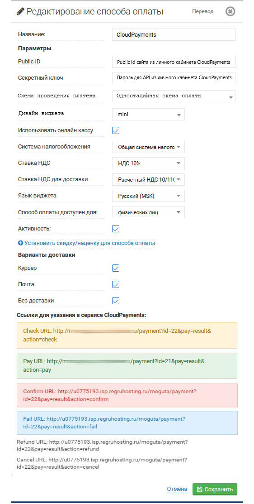

# CMS-Moguta-CP

Модуль позволит добавить на ваш сайт оплату банковскими картами через платежный сервис [CloudPayments](https://cloudpayments.ru). 
Для корректной работы модуля необходима [регистрация в сервисе](https://cloudpayments.ru/Docs/Connect).

## Совместимость:
Начиная с версии [релиза Moguta.CMS 8.0](https://moguta.ru/blog/istoriya-versiy/reliz-moguta-cms-8-0) установка не требуется, модуль уже предустановлен.

### Параметры модуля Cloudpayments

Настройки -> Оплата -> Способы оплаты -> Cloudpayments -> Редактирование:

* **Public_id** - Public id сайта из личного кабинета CloudPayments;
* **Секретный ключ** - Пароль для API из личного кабинета CloudPayments;
* **Использовать онлайн-кассу** - Включение/отключение формирования онлайн-чека при оплате
* **Система налогооблажения** - Тип системы налогообложения;
* **Ставка НДС для заказа** - Укажите ставку НДС товаров;
* **Ставка НДС для доставки** - Укажите ставку НДС службы доставки;
* **Язык виджета** - Русский МСК (Если не предусматривается использовать другие языки);
* **Способ оплаты доступен для** - Выбор для каких лиц будет доступен платежный модуль;
* **Активность** - Включение/Отключение модуля.
* **Варианты доставки** - Выбирите необходимый вариант доставки при котором будет вызываться виджет.

Не забудьте сохранить введенные параметры.

В личном кабинете [CloudPayments](https://merchant.cloudpayments.ru) в настройках сайта необходимо включить следующие уведомления:
* **Check уведомление**:\
`http(s)://domain.ru/payment?id=22&pay=result&action=check`
* **Pay уведомление**:\
`http(s)://domain.ru/payment?id=21&pay=result&action=pay`
* **Refund уведомление**:\
`http(s)://domain.ru/payment?id=22&pay=result&action=refund`
* **Fail уведомление**:\
`http(s)://domain.ru/payment?id=22&pay=result&action=fail`

где **domain.ru** — доменное имя вашего сайта. Во всех случаях требуется выбирать вариант по умолчанию: кодировка — UTF-8, HTTP-метод — POST, формат запроса — CloudPayments (уведомления **Pay** и **Refund**).

### Интеграция с онлайн-кассой

Сервис [CloudKassir](https://cloudkassir.ru) предоставляет в аренду онлайн-кассы для Вашего интернет-магазина на платформе [Moguta.CMS 8.0](https://github.com/EvgeniyTr/CMS-Moguta-CP) в соответствии требованиям ФЗ-54.  
Для корректной работы модуля необходима регистрация в сервисе.
Порядок регистрации описан в [документации CloudKassir](https://cloudkassir.ru/#subscribe).
